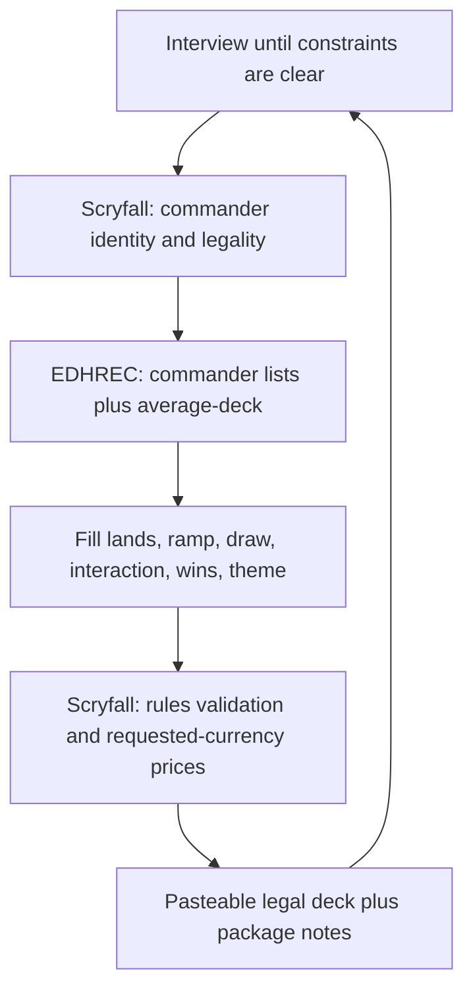
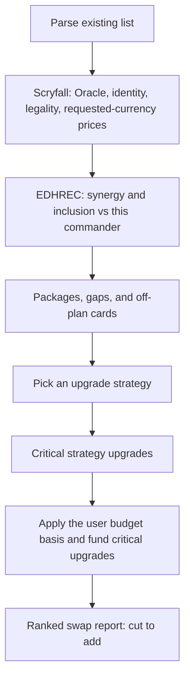

# Commander deck builder

Build or review a Commander deck from the user's constraints, then keep one canonical Archidekt-safe list. Ask first. Do not guess commander, budget, pets, or table rules.

Interview questions and category checks live in [guides.md](guides.md). The default construction baseline and response structure live in [fundamentals.md](fundamentals.md). Apply that baseline unless the user's power level, curve, land strategy, or other hard constraint calls for a different plan; explain deviations. Do not invent default budgets or sample table rules.

## Preflight

This skill needs `scryfall`, `edhrec`, and `archidekt`. The Skills CLI does not install dependencies for you.

If any of them is missing from this session, stop. Tell the user to install the full repo:

```
npx skills add reakaleek/mtg-commander-deck-builder-skills
```

Find each helper from the installed skill directory that contains that skill's `SKILL.md`. Run `scripts/scryfall.py`, `scripts/edhrec.py`, or `scripts/archidekt.py` from that folder, or pass the full path to the file. Do not search the repo and read the `.py` source. If a flag is unclear, run `--help`. Open the source only if the command fails.

Do not replace their helpers with ad-hoc HTTP. Do not reimplement curl.

## Modes

Two modes, one interview.

1. Greenfield build
2. Review of an existing list

Skip questions the user already answered. Keep asking until constraints are clear. Always finish intake with this open question, written as a real question to the user, not as an example they should copy:

Anything else to consider?

Treat the answer as hard constraints. Apply what they said. If they forbid a tactic, do not add it. If they describe the table, build and review for that table.

## Constraint ledger

Keep a short ledger:

- Hard: legality, table rules, exclusions, budget
- Preference: theme, pets, play style

Never silently violate a hard constraint. If two hard constraints conflict, pause and ask which one wins.

Repeat their constraints under **Table rules** in every report. If they add more later, apply them immediately.

## Shared intake

Cover what is still unknown:

- Mode: new deck or review
- Commander, or help picking one
- Theme and win style
- Bracket or power, pet cards, house bans
- Budget and currency, only if they have one. Ask whether it means total deck value or additional upgrade spend, whether already-owned cards count, and whether proxies are allowed. Do not invent a cap or a reading of "budget."
- Cards they already own, and whether a proxy counts as owned
- Existing list versus a complete new deck
- Canonical deck file path
- Combo and tutor preferences, and how much decision complexity they want, only when power or table rules did not already settle it
- For a review, how recent games felt: record the functional failure as no mana,
  no board, no cards, no answers, or commander too late
- Which turn they first did something that mattered; use that turn as the review
  target
- Whether they already own the current list; if yes, the buy list contains only
  new cards versus that source
- Whether the table uses house prices or extra rules for flagged cards; never
  invent a rule
- The open question above

Resolve the commander with `scryfall` `named --fuzzy`, then confirm identity and legality with the user.

## Canonical deck file

One Archidekt-safe text file is the accepted deck.

- Ask for the path before the first write. If they already gave a local file, ask whether that file should become canonical before overwriting it.
- If they pasted a list, normalize it and create the file at the path they approved.
- Keep the file boring: only `quantity + exact Oracle name`, one card per line. The file itself is pasteable into Archidekt.
- During a new build the file may be a partial list. Validate names and quantities at each checkpoint. Enforce complete Commander construction only when declaring the deck final.
- During review, proposed swaps stay in the report. Update the file only after the user accepts a swap or an upgrade batch.
- After every accepted change: write atomically with `scryfall` `write-deck`, then reparse, resolve names, and validate the rules that apply to this checkpoint.
- Do not keep revision snapshots. One file is the source of truth. If the path points at an unrelated file, stop and ask.
- Generate the final Archidekt import block by reading that file, not from chat memory.
- After each successful write, report the path and what changed.
- The file stores the card list only. Keep budget assumptions, constraints, and analysis in the report unless they ask to persist those separately.

## Archidekt input and output

Likely input is an Archidekt text export or an Archidekt deck URL.

If they give a deck URL instead of a paste, fetch it with `archidekt` first, then hand the result to `scryfall`:

```
python scripts/archidekt.py fetch URL --out FILE
```

Then parse and validate the file through `scryfall`:

```
python scripts/scryfall.py parse-deck FILE
python scripts/scryfall.py validate-deck FILE
python scripts/scryfall.py write-deck DEST
```

Those commands live in the `scryfall` and `archidekt` skills. Run them from each skill's own directory. Do not read `scryfall.py` or `archidekt.py`.

Parsing rules the helper already enforces:

- Accept minimal `quantity + card name` lines and common Archidekt exports with `x`, set code, collector number, foil marker, category, label color metadata, and section headers.
- Preserve quantity, exact name, supplied printing or treatment, and categories.
- Separate recognized command-zone, sideboard, maybeboard, and out-of-deck entries. Never silently count sideboard or maybeboard cards in the deck.
- Report ambiguous custom categories and ask whether they belong in the deck.
- Parse metadata from the right so punctuation or numbers inside a real name survive.
- Feed exact printing identifiers to Scryfall when supplied. Otherwise resolve by exact Oracle name after normalization.

Every build or review ends with a fenced block labelled **Archidekt import**.

Every review or upgrade also ends with a second fenced block labelled **Archidekt import: buy list**. During a new build, add that second block when they named cards they already own.

Inside each block:

- Only `quantity + exact Oracle name`
- One card per line
- No headings, categories, prices, bullets, comments, set codes, or analysis

The full-deck block also includes command-zone cards. Outside that block, say which imported card or cards the user must mark as Commander or Premier in Archidekt. The minimal text format does not keep that flag.

The buy list is not the deck. It is only the cards they still need to purchase:

- Ask which cards they already own. Do not guess a collection.
- For review and upgrade, the default is accepted or proposed adds they do not own. If they said they do not own the current list, the buy list is every card in the accepted deck they do not own. Ask if that choice is still unclear.
- Never include cuts, owned cards, sideboard, maybeboard, or out-of-deck piles.
- If proxies are allowed and they will proxy a card, leave it off the buy list unless they still want to buy it.
- Quantities are only the copies they still need.
- Proposed swaps produce a proposed buy list. After they accept, rebuild the buy list from the accepted adds only.

Put every explanation before both import blocks. Label each fence. The last fence is the buy list when one exists, so they can copy it without cleanup.

Run `validate-deck` on the full-deck block before delivery. Check syntax, quantities, resolved names, legal Commander construction when the deck is final, and no sideboard or maybeboard leakage. Validate the buy list for syntax, quantities, and resolved names only. Do not require legal Commander size on a buy list.

The full-deck import block must match the canonical file exactly. Do not write the buy list into that file. If they want the buy list on disk, ask for a separate path and write it with `write-deck`.

## Evidence order

When sources disagree, use this order:

1. Commander rules and current Scryfall Oracle and legality data
2. User hard constraints and stated strategy
3. Functional role in the actual list
4. EDHREC inclusion and synergy as metagame evidence, never as proof that a card is good or bad

Low EDHREC inclusion alone is not a cut reason. Call a card "critical" only when its role fixes a demonstrated failure or enables the user's stated plan.

## Guides

Answer the questions in [guides.md](guides.md) from this commander, this list, and this interview.

Build and review both print **Category counts**. Raw counts only. No target column. If a swap exists to fix a real hole, say so in Why.

When a jargon term first appears, define it in one sentence (for example,
“tutor” means a card that searches for another card). Use the same rule for
mill, Game Changer, buy list, loop, and payoff.

Count each card once under one primary role; use secondary tags only to explain
overlap. Include what the commander supplies and when it usually becomes
available, rather than treating a late commander as early ramp or draw. Mark
whether each relevant card works alone or needs another permanent, graveyard,
or token. Count always-tapped lands and other delayed mana sources. For any
card that checks a property of other cards, verify that property across the
whole list, not only a count of one card type.

## Build mode



- EDHREC average-deck, High Synergy, and Top Cards are a baseline, not the finished list. Drop anything that violates table rules even if it is a staple.
- `scryfall` `collection` resolves names and card data. Validate legal deck size, commander eligibility, color identity, format legality, singleton rules and explicit exceptions, plus partner, background, or companion structure when those apply.
- `scryfall` `search` fills holes with constraints derived at run time. Do not invent example queries here.
- If a budget is set, run the same price rules as review mode before delivering the list.
- Before the first swap or finalized recommendation, run a simple opening-hand
  or goldfish check against the stated failure. State that it is a heuristic,
  not a real multiplayer game. Before sending the report, ask whether the
  proposed changes would alter the last game in the way the user described; if
  not, revise them.

**Build output.** Category counts, package notes, and a why-line for picks that are not obvious, then the validated Archidekt import block. If they named owned cards, add the buy-list block after it. No quota on how many notes.

After a finalized block, you may offer a handoff to `commander-deck-playbook`. Do not append a playbook yourself.

## Review mode

Synergies, a coherent upgrade strategy, then explicit swaps under the user's budget. Invent the path. Do not only patch holes or chase EDHREC top cards.



1. Accept a pasted list, a local file, or an Archidekt deck URL. Fetch a deck URL with `archidekt` `fetch` rather than scraping the page. Preserve quantities, commander designation, set and collector information when supplied, and a user-provided owned versus not-owned distinction. Ask for owned cards if they have not said. If the URL cannot be fetched (private deck, unsupported site), ask for a pasted export instead.
2. Fetch every card with Scryfall. Need `oracle_text` including every face, `type_line`, `color_identity`, `legalities.commander`, and the current Game Changer flag. Validate construction before strategy analysis.
3. Pull EDHREC commander lists. Note high-synergy misses and broad metagame patterns, with sample size and inclusion context where available. Do not label low-inclusion cards as dead.
4. Ground synergy claims in Oracle text, not memory.
5. Write an upgrade strategy first, one short paragraph, then swaps that execute it. Pick what fits this list:
   - Close a demonstrated functional gap before chasing power.
   - Tighten a package the commander already wants. Same engine, better pieces.
   - Replace off-plan cards with on-plan ones, even if the add is cheaper.
   - Mana-base or curve work when the strategy is fine but the deck is clumsy.
   - If budget remains under the cap, spend it on the highest-leverage on-plan upgrade, not a random staple.
6. Propose upgrades as one-for-one swaps, or a small bundle when one expensive cut funds one critical addition. Rank them by how much they serve the stated strategy. Never a shopping list without cuts.
   Before recommending every addition, verify and state its justification:
   the stated failure or plan it addresses, which existing cards already do
   that job, why this copy is better than a replacement or no change, and any
   dependency or added decision complexity. If three or more cards already do
   the job, skip the addition or replace the weakest copy.
7. Budget only if the user set a cap and currency. Use `scryfall` `prices`. Apply their chosen basis: total value or additional spend, owned cards included or excluded. When the basis is additional spend, price the buy list, not the whole deck. Report price coverage and uncertainty. Stay at or under their cap after every accepted swap.
8. If a critical addition exceeds budget, do not drop the strategy. Find a cheaper card that does the same job as an expensive non-core piece. Cut that, free money, then add the critical card. Say which role stayed intact.
9. If nothing can be downgraded without breaking the plan, say so and offer a cheaper functional stand-in for the critical addition itself.

Do not recommend a swap that breaks a hard constraint. Rejected swaps leave the canonical file unchanged.

Before the first swap list, run a simple opening-hand or goldfish check against
the stated failure and say that it is a heuristic, not a real multiplayer
game. An early-game complaint needs cheap cards that affect the board or life
total before the commander; a late-game complaint needs finishers or resets.
Do not use a high-mana version of the same plan to fix a slow start. Before
sending the report, ask whether these swaps would change the last game in the
way the user described; if not, revise them.

When cutting a card, state which capability leaves the deck. Replace the role,
not merely the first legal or cheap card, when a cut is required for legality,
budget, or a house rule. Prefer lasting board presence and cards that work from
an empty board; explicitly flag adds that need another piece. Split interaction
recommendations by job (stop an attack, remove one threat, reset one player, or
reset the table). Say when the color identity cannot do the requested job
cheaply and offer the nearest real option without calling a fog a wrath.

### Swap report

Every suggestion uses this shape. Show both Oracle texts. The bracketed words are placeholders, not cards.

```markdown
### [Cut] → [Add]
- Role: ramp / draw / interaction / win / land / theme
- Price: old → new (delta). Running list total → new total of {user cap, if any}
- Why: one short paragraph. Strategy kept because …

**Leaving ([Cut])**
> Oracle text of the old card

**Entering ([Add])**
> Oracle text of the new card
```

Lead the report with **Constraints**, price basis and coverage plus total versus cap if set, legality and identity flags, **Category counts**, synergy packages, **the upgrade strategy**, then the ranked swaps. End with the validated full-deck Archidekt import, then the **Archidekt import: buy list**. After accepted changes, both blocks follow the updated canonical file. If they have not accepted yet, the full-deck block is the current file and the buy list is the proposed adds they do not own.

For every important line, include setup, spell order, mana left after the
first spell, and what happens if the second spell is countered or the first
piece dies. In the first report, name popular commander cards that are not
being added and why. After a full import, print a delta containing only new
cards plus a short cut list, and add a brief how-to-use note for each new card
whose timing or mode is not obvious. If another review arrives, say which
useful diagnosis was kept and reject incorrect counting. After a finished list,
offer a playbook handoff for mulligans, lines, and recovery without writing it
unless asked.

## Pricing

- If set, collector number, or treatment is supplied, price that printing.
- Otherwise use the cheapest available normal printing in a Scryfall-supported currency. A random collection response is not the cheapest.
- Do not convert currencies. Do not infer foil versus nonfoil without permission.
- Keep missing prices unknown. Report coverage. Do not claim strict budget compliance when unresolved prices could change the result.
- Include source or cache freshness in budget output.

```
python scripts/scryfall.py prices FILE --currency CODE
```
